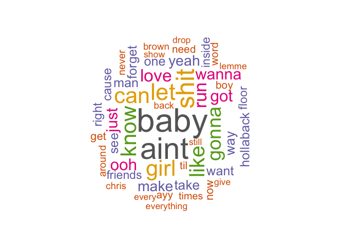

Web Scraping: Billboard Hot 100 Era Songs and Lyrics
================

  - October 24, 2019
  - DATA 900 - Professor Gyory
  - Jacob Mannix

#### Process Outline

1.  **Wikipedia**
    1.  Access Wikipedia “Billboard Hot 100 Era” top singles by year
        (available years: 1958-2019)
    2.  Get the table of top songs for a particular year
    3.  Get a list of unique top songs w/ artist names for a particular
        year
2.  **Genius**
    1.  Use the wikipedia lists to access song lyrics for each song
    2.  Create lists of all song lyrics for a particular year
3.  **Visualizations**
4.  **Analysis**

### Loading Libraries and Variables

``` r
library(rvest)
library(RSelenium)
library(tidyverse)
library(stringr)
library(tm) # text mining
library(wordcloud) # world cloud
library(RColorBrewer) # color palettes
library(SnowballC) # text stemming
library(knitr)
library(rmarkdown)
```

``` r
load("/Users/jacobmannix/Box Sync/M.S. Analytics/Analytics Fall/DATA 900/Web Scrapping/Assignment/Web Scraping Assignment Data Variables/Songs1980_2015.RData") # Songs
load("/Users/jacobmannix/Box Sync/M.S. Analytics/Analytics Fall/DATA 900/Web Scrapping/Assignment/Web Scraping Assignment Data Variables/lyrics1980_2015.RData") # Lyrics
load("/Users/jacobmannix/Box Sync/M.S. Analytics/Analytics Fall/DATA 900/Web Scrapping/Assignment/Web Scraping Assignment Data Variables/docsAll.RData") # docs
```

## P1: Wikipedia

### P1.1: Accessing Wikipedia “Billboard Hot 100 Era” top singles by year

Read the wikipedia page for the years of “Billboard Hot 100 Era” top
singles

``` r
# Reading page for "Billboard Hot 100 Era" top singles
billboard_singles <- read_html("https://en.wikipedia.org/wiki/List_of_Billboard_number-one_singles")

# Getting list of all years where Billboard had a "Hot 100 Era" list
hot100_years_full <- billboard_singles %>%
  html_nodes("tbody") %>%
  html_nodes("tr") %>%
  html_nodes("td") %>%
  html_nodes("a") %>%
  html_text()

# Trimming the list above to the years of "Hot 100 Era" only (1958-2019)
hot100_years_all <- hot100_years_full[c(23:62)] #(1:62) #trimming the list of years
hot100_years_all
```

    ##  [1] "1980" "1981" "1982" "1983" "1984" "1985" "1986" "1987" "1988" "1989"
    ## [11] "1990" "1991" "1992" "1993" "1994" "1995" "1996" "1997" "1998" "1999"
    ## [21] "2000" "2001" "2002" "2003" "2004" "2005" "2006" "2007" "2008" "2009"
    ## [31] "2010" "2011" "2012" "2013" "2014" "2015" "2016" "2017" "2018" "2019"

<center>


</center>

### P1.2: Get the table of top songs for a particular year

``` r
hot100_years <- "2005" # Here you can choose a specific year to look at
hot100_list <- c()  # Creating an empty list for the songs

for(i in hot100_years){
  hot100_session <- html_session("https://en.wikipedia.org/wiki/List_of_Billboard_number-one_singles") # Initializing HTML Session
  
  hot100_link <- hot100_session %>% 
    follow_link(i)
  
  hot100_chart <- hot100_link %>% # Get the song charts for a specific year
    # html_nodes("table.wikitable.plainrowheaders") %>% #2010 and after
    html_nodes(xpath = "/html/body/div[3]/div[3]/div[4]/div/table[2]") %>% #Before 2010
    html_table(fill = TRUE, header = 1)
  
  hot100_list <- append(hot100_list, hot100_chart) # Appending the table/songs to the overall list
}
```

### P1.3: Get a list of unique top songs w/ artist names for a particular year

``` r
# Converting list to a dataframe and getting unique list of songs and then back into list
hot100_df <- data.frame(hot100_list)[3:4]
hot100_df$Song.Artist <- paste(hot100_df$Song, hot100_df$Artist.s.)

hot100_songs_df <- unique(data.frame(hot100_df)[3]) # Getting unique list of songs and artists

hot100_songs_list <- c()
for (i in hot100_songs_df){
  hot100_songs_list <- str_replace_all(i, "[:punct:]", '') # Removing all punctuation from the list
  # hot100_songs_list <- str_replace_all(i, '"', '')
}

Songs2018 <- hot100_songs_list # Saving song lists for an individual year
Songs2018
```

    ## [1] "Let Me Love You Mario"                      
    ## [2] "Candy Shop 50 Cent featuring Olivia"        
    ## [3] "Hollaback Girl Gwen Stefani"                
    ## [4] "We Belong Together Mariah Carey"            
    ## [5] "Inside Your Heaven Carrie Underwood"        
    ## [6] "Gold Digger Kanye West featuring Jamie Foxx"
    ## [7] "Run It Chris Brown"                         
    ## [8] "Dont Forget About Us Mariah Carey"

<center>


</center>

## P2: Genius

### P2.1 Using the cleaned list of songs and artists to get lyrics for each song

``` r
#Take Dataframe and pass song name into genius.com, Using RSelenium to access Genius.com lyrics for each song
driver <- rsDriver(browser = c("firefox"))
remote_driver <- driver[["client"]]
remote_driver$open()

# Looping through each song name and getting lyrics for each song
lyrics_list <- c()
lyrics_out <- c()
# hot100_songs_list <- Songs2018

for(i in 1:length(hot100_songs_list)){
  remote_driver$navigate("https://genius.com")

  remote_driver$refresh() #Refresh to home page
  Sys.sleep(2)
  address_element <- remote_driver$findElement(using = 'xpath', value = '/html/body/div/div/div[1]/form/input')
  address_element$sendKeysToElement(list(hot100_songs_list[i]))
  Sys.sleep(2)

  button_element <- remote_driver$findElement(using = 'xpath', value = "/html/body/div/div/div[1]/form/div[2]")
  button_element$clickElement()
  Sys.sleep(2)
  button_element2 <- remote_driver$findElement(using = 'class', value = "mini_card")
  button_element2$clickElement()
  Sys.sleep(2)

  lyrics_out <- remote_driver$findElement(using = "xpath", value="/html/body/routable-page/ng-outlet/song-page/div/div/div[2]/div[1]/div/defer-compile[1]/lyrics/div/div/section")
  Sys.sleep(2)

  lyrics_list_text <- lyrics_out$getElementText()
  lyrics_list <- append(lyrics_list, lyrics_list_text)
  #lyrics_list <- lyrics_list[-c(1)]
}
#driver$server$stop()  # Drops the connection to the server

#Write Lyrics to CSV or text file
# write.csv(lyrics_list, file = "test1980lyrics.csv")
# lyrics1980 <- lyrics_list
# lyrics1980 <- lyrics1980[-c(6,7)]
# lyrics1985 <- lyrics1985[-c(8,16)]
# lyrics1990 <- lyrics1990[-c(3,12)]
# lyrics2015 <- lyrics2015[-c(2)]
```

## P3: Visualizations and Analysis

### P3.1 Preparing the Lyrics for Visualizations

``` r
# Preparing the Lyrics for Visualizations
# text <- read.csv(file = '/Users/jacobmannix/Desktop/test1980lyrics.csv')
docs <- Corpus(VectorSource(lyrics_list))
# inspect(docs)

# Cleaning up the docs
toSpace <- content_transformer(function (x , pattern ) gsub(pattern, " ", x))
docs <- tm_map(docs, toSpace, "/")
docs <- tm_map(docs, toSpace, "@")
docs <- tm_map(docs, toSpace, "\\|")

# Cleaning up the docs further
docs <- tm_map(docs, content_transformer(tolower)) #to lower case
docs <- tm_map(docs, removeNumbers) # Remove numbers
docs <- tm_map(docs, removeWords, stopwords("english")) # Remove english common stopwords
docs <- tm_map(docs, removePunctuation) # Remove punctuations
docs <- tm_map(docs, stripWhitespace) # Eliminate extra white spaces
docs <- tm_map(docs, removeWords, c("chorus", "verse"))
# docs <- tm_map(docs, removeWords, c()) # Remove your own stop word

# Creating a Term Document Matrix to display most frequently used words
dtm <- TermDocumentMatrix(docs)
m <- as.matrix(dtm)
v <- sort(rowSums(m),decreasing=TRUE)
d <- data.frame(word = names(v),freq=v)
head(d, 15)
```

    ##        word freq
    ## baby   baby   52
    ## aint   aint   47
    ## shit   shit   39
    ## let     let   35
    ## can     can   33
    ## girl   girl   33
    ## know   know   32
    ## like   like   31
    ## gonna gonna   28
    ## run     run   25
    ## love   love   24
    ## got     got   22
    ## ooh     ooh   22
    ## just   just   21
    ## wanna wanna   21

### P3.2 Wordcloud

``` r
set.seed(1234)
wordcloud(words = d$word, freq = d$freq, min.freq = 1,
          max.words=50, random.order=FALSE, rot.per=0.35,
          colors=brewer.pal(8, "Dark2"))
```

<!-- -->

### P3.3 Frequency

``` r
# Plotting word frequencies as Barplot
barplot(d[1:10,]$freq, las = 2, names.arg = d[1:10,]$word,
        col ="lightblue", main ="Most frequent words",
        ylab = "Word frequencies")
```

<!-- -->

### P4: Overall Analysis

#### P4.1: Number of Songs per year

``` r
kable(year_song_counts, format='markdown')
```

| Year | Count |
| :--- | ----: |
| 1980 |    17 |
| 1985 |    27 |
| 1990 |    26 |
| 1995 |    12 |
| 2000 |    18 |
| 2005 |     8 |
| 2010 |    17 |
| 2015 |     9 |

#### P4.2: List of Song Names per year

<center>


</center>

#### P4.3: WordClouds

<center>


</center>

#### P4.4: Word Frequencies

<center>


</center>

#### P4.5: Top words throughout all specified years

``` r
kable(head(d, 20), format = 'markdown') # Top 20 words and frequency from all specified years
```

|       | word  | freq |
| :---- | :---- | ---: |
| love  | love  |  468 |
| baby  | baby  |  352 |
| know  | know  |  311 |
| just  | just  |  307 |
| like  | like  |  282 |
| say   | say   |  268 |
| can   | can   |  263 |
| take  | take  |  254 |
| yeah  | yeah  |  241 |
| one   | one   |  218 |
| got   | got   |  191 |
| now   | now   |  185 |
| get   | get   |  174 |
| time  | time  |  174 |
| come  | come  |  173 |
| let   | let   |  173 |
| want  | want  |  166 |
| wanna | wanna |  156 |
| cause | cause |  150 |
| day   | day   |  149 |
